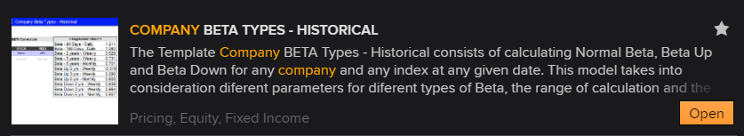

# Company Beta Types - Historical
## Calculate Company Beta Types - Historical with LSEG Data Library for Python

This article and sample code demonstrate how to use the LSEG Data Library for Python to calculate Normal Beta, Beta Up, and Beta Down for any company and index on any given date, following the methodology outlined in the Company Beta Types – Historical Workspace Excel template.

This methodology incorporates different parameters for each type of Beta, including the calculation range and the periodicity of the data.

- __Normal Beta__ measures a security’s volatility relative to the overall market.
- __Beta Up__ measures a security’s volatility relative to the market, but only on days when the benchmark’s return is positive.
- __Beta Down__ measures a security’s volatility relative to the market, but only on days when the benchmark’s return is negative.

For the full article, please refer to [this link](https://developers.lseg.com/en/article-catalog/article/company-beta-types---historical) on the [LSEG Developer Community Website](https://developers.lseg.com/en).
